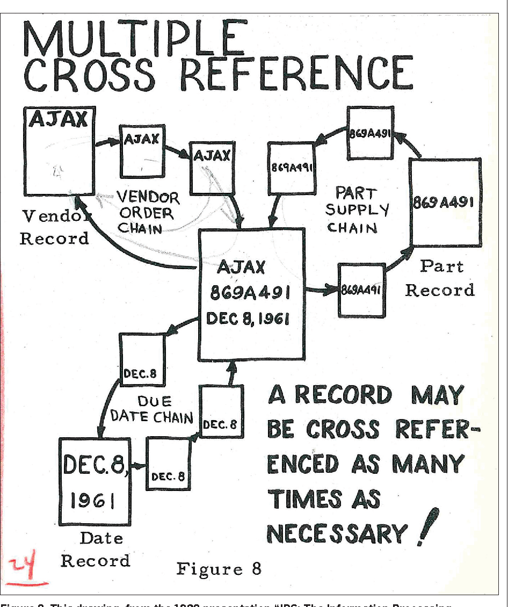
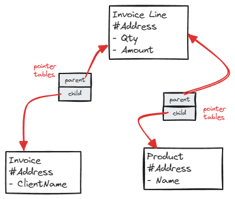
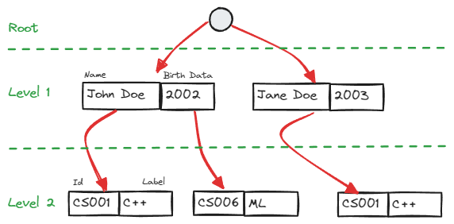
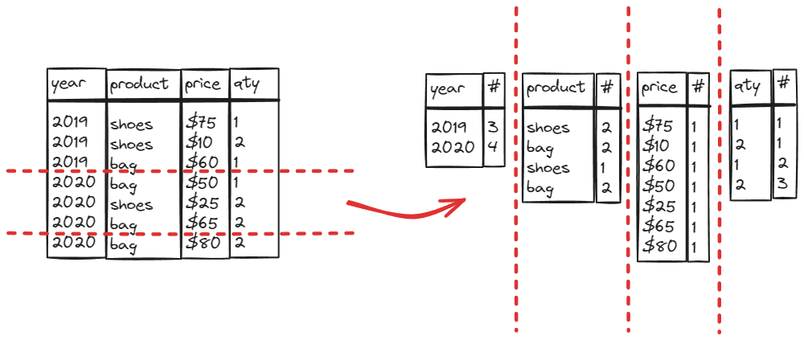

<!-- _class: lead -->
# **Module 1**
History of Databases

---

# **Database System**
What would be __your__ definition?

---

# **Database System**

A commonly accepted definition would be
>  **Database**: a system that can handle _arbitrary_ datasets

Any idea in which **decade** those were invented?

---

# **1960s - IDS**

**Charles Bachman** joins **General Electric** to work on what is commonly accepted as the first ever **DBMS** (**D**ata**b**ase **M**anagement **S**ystem) named  **Integrated Data Store** a.k.a. **IDS**


He received the **Turing Award** in 1973

---
# **Yes, GE was selling this in 1964 ⤵️**


---
# **IDS**

Network Database
  _(more on this later)_



---
# **CODASYL**

**C**onference **O**n **DA**ta **SY**stems **L**anguages

**COBOL** developers that wanted to come out with **APIs** for data storage and retrieval

**Charles Bachman** joins them in 1965, pushing many ideas from **IDS**

---
# **Network model**
Codasyl and IDS were both using this model



---
# **Hierarchical model**

At the same time, another competing approach was the so-called **Hierarchical** Model

Pushed by IBM's **Information Management System** or IMS


Any idea why this was used? (tip on the right)

---
# **Hierarchical model**
Think of an **xml**, **json** or **yaml** file




---
<!-- _class: tip -->

# **Edgar Codd**


Mathematician, working at IBM

Had the idea of an abstraction over the way data is **physically** stored

The **Relational Model**

---
# **Edgar Codd**


 **A Relational Model of Data for Large Shared Data Banks** is published in 1970

One of the **most fundamental** papers in CS history

> 💡I strongly advise you to read it

---
# **1970s: Implementing relational dbs**

 **IBM** develops **System R** following Edgar Codd's work

**Michael Stonebraker** starts **Ingres** at UC Berkeley and later quits to commercialize it

**Larry Ellison** founds **Oracle**

---
# **Market overtake in the 80s**

**IBM** finally ships **DB2**

**Oracle** becomes the leader

Stonebraker comes back to Berkeley to start a new project named **Postgres**

---
# **A few events in the 1990s**

**Microsoft** enters the market following some high level of drama

**PostgreSQL** is Postgres with SQL support

**MySQL** is created

**OLAP Cubes** are the brand new hot thing, following Essbase

---
# **The "Internet Era" changes everything**

Data volumes **explode**

---
# **MapReduce**


**Jeff Dean** published _MapReduce: Simplified Data Processing on Large Clusters_ in 2004

 **MapReduce** is a programming model using two functions
```
map(k1, v2) -> list(k2, v2)
reduce(k2, list(v2)) -> list(v2)
```
---
# **Rise (and fall) of Hadoop**

**Yahoo** open sources its implementation of MapReduce.
All those projects become the Hadoop ecosystem.


---
# **Stonebraker disagreed**
> 💬 _MapReduce represents a **giant step backwards**. The database community has learned the following three lessons since [...] 1968_
>1. _Schemas are good_
>2. _Separation of the schema from the application is good_
>3. _High-level access languages are good_
>
>_MapReduce has learned **none** of these lessons and represents a **throw back to the 1960s**_
>
> **Michael Stonebraker** - _MapReduce: A major step backwards_ - 2008

---
# **CStore (2006)**
Storing in columns is way more efficient for analytic workloads


---
# **Massively Parallel Data Warehouses**

Stonebraker - again - leaves research to start a database company named **Vertica**

Some others will implement the same idea (e.g. **Paraccel**)

---
# **Columnar Everywhere**

**Apache Parquet** will be started by Twitter and Cloudera as a columnar filesystem for Hadoop clusters in 2013

It is still the most popular columnar file format, supported by pretty much anything

---
# **Distributed SQL**


**Jeff Dean** - him again! - publishes _Spanner: Google’s Globally-Distributed Database_ - in 2012
- Multi-version
- Distributed
- Synchronously-Replicated

This led to multiple implementations (without atomic clocks though)

---
# **Cloud Native**


