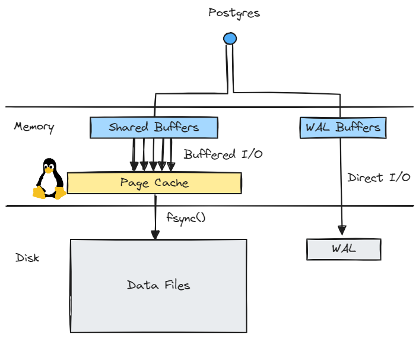

<!-- _class: lead -->
# **Module 1**
Storing Data Safely

---
# **Numbers any engineer should know**

---
# **Pros and cons of disks**

👍 They have a bigger capacity than volatile memory or caches

👍 They are **persistent**

😔 They are **slow**

---
# **How do this?**

🙋 Any guess?

---
# **Using the OS**

`mmap` allows for mapping in virtual memory a physical file

**But** this is problematic. Why? 🙋

---
# **Using the OS**

`mmap` allows for mapping in virtual memory a physical file

**But** this is problematic. Why? 🙋

For **performance** reasons mostly. Pages can be evicted at any time, which could stall processes

---
# **Buffer Pool**

Most DBMS choose instead to, implement their own layer, sitting **between** the database process and the filesystem.

---
# **Buffer Pool**
Database files are split in **pages** of a few KBs

A page is the **smallest** unit of storage the DBMS can interact with

➡️ Postgres uses 8KB pages by default (same for Microsoft SQL Server)

The **Buffer Pool** is a cache of pages, organized as an in-memory array

---
# **Buffer Pool**
The Buffer decides **when** data is read from disk to memory, and **when** pages are persisted to disk

The Buffer Pool generally does `O_DIRECT`, but Posgres does not.

---
# **Anatomy of Postgres storage**

---
# **😱 Postgres uses Buffered I/O ?**

It started as a **research** project in the 1980s and only has still a few contributors

Main focus was on the **database engine** itself

A Direct I/O stack is **hard to implement**

---
# **Data Files**

How are **standard** types stored?

🙋 How are `NULL`s stored?

For big enough values, store them in specific pages (**TOAST** pages in Postgres)

> **TOAST** = **T**he **O**versized-**A**ttribute **S**torage **T**echnique

---
# **Tuple Alignment**

> Alignment: Making sure that tuples are stored on multiples of 64 bits.

Some systems reorganize columns in the tuple.
PostgreSQL will **pad** every type to make sure that everything is **64-bit** aligned

---
# **Holy grail of linearizability**

Database systems would be **easier to write** if they were single process and single user

We would love transactions to appear as if they were executed in a **global order**, even if they are executed **concurrently**

This property is called **linearizability** and is often used in distributed systems

---
# **Dealing with concurrency**

However in real life we will have **multiple users** running multiple concurrent queries

> How do we solve this?

---
# **Transaction**

A sequence of **Read** and **Write** operations that has the four well known **ACID** properties
🙋 Remember what they stand for?

---
# **ACID**

**Atomicity**: All changes commit or none
**Consistency**: They only tranistion from a valid state to another
**Isolation**: They execute isolated from each other
**Durability**: Committed transactions persist despite system failures

---
# **Atomicity & Durability**

To provide **both**, the best way is to use a **log**
First write all operations in a queue, and apply them once committed

---

# **Write-Ahead Log (WAL)**

All **operations** are written in the log

`CHECKPOINT` is a special one

---
# **Recap**

---
# **Checkpoint**

Happens automatically **every few minutes**

1. Get the current WAL **position**
2. Write data from Buffer Pool to **page cache**
3. Call `fsync` on **all modified files**
4. Mark the point of recovery, and clean the log

❓ Did you recently hear about **issues** there (think of `fsync`)?

---
# **Isolation Anomalies**

**Isolation** is another story
We are trying to prevent the following to happen:
- **Dirty** reads: reading uncommitted changes
- **Non-repeatable** reads: reading a value has been changed by another committed transaction
- **Phantom Reads** reads: reading a value that has been inserted by another committed transaction

---
# **Isolation Levels**

- **Read Uncommitted**: Allows dirty reads, non-repeatable reads, and phantom reads
- **Read Committed**: Prevents dirty reads but allows non-repeatable and phantom reads
- **Repeatable Read**: Prevents dirty and non-repeatable reads but allows phantom reads
- **Serializable**: Ensures the highest level of isolation, preventing all anomalies

---
# **How to guarantee this?**

There are mainly two approaches.
🙋 Can you name one?

---
# **How to guarantee this?**

There are mainly three approaches.
🙋 Can you name one?

**MVCC**, **Locks** and **Optimistic CC**

---
# **Optimistic Concurrency Control**

Assume that everything _generally_ goes fine
1. Record the transaction beginning timestamp
2. Prepare the values to write
3. If the destination has not changed since the beginning of the transaction, `COMMIT`, otherwise, `ROLLBACK`

---
# **Locks**

A **Lock Manager** grants different kinds of locks on objects, such as **Exclusive** or **Shared** locks

Some locks are compatible with each other.
> in most DBMS, `SELECT` will acquire a S lock that is compatible with other S locks. However, modifying the table requires an X lock

Locks limit the **concurrency**

---
# **MVCC**

Every operation operates on a **snapshot** of the database

> Reading never blocks writing and writing never blocks reading.

Tuples are not modified in **place**

**Problems**: outdated blocks need to be **cleaned up** and txid wraparound 💀

---
## **Isolation Levels in PostgreSQL**

- `REPEATABLE_READ` is provided by taking a snapshot at the beginning of the transaction. Concurrent updates will lead to a so-called serialization error and a `ROLLBACK`
- `SERIALIZABLE` is the same with a stronger guarantee: if a table is **read** by two concurrent transactions, one is aborted
- `READ_COMMITTED` is the default
- `READ_UNCOMMITTED` does not really exist
🙋 Why?

---
## **Recap**

- We looked at how PostgreSQL **stores data on disk**
- We saw that it uses a **log** named the **WAL** to ensure atomicity and durability
- Isolation is provided by **transactions** that have different isolation levels
