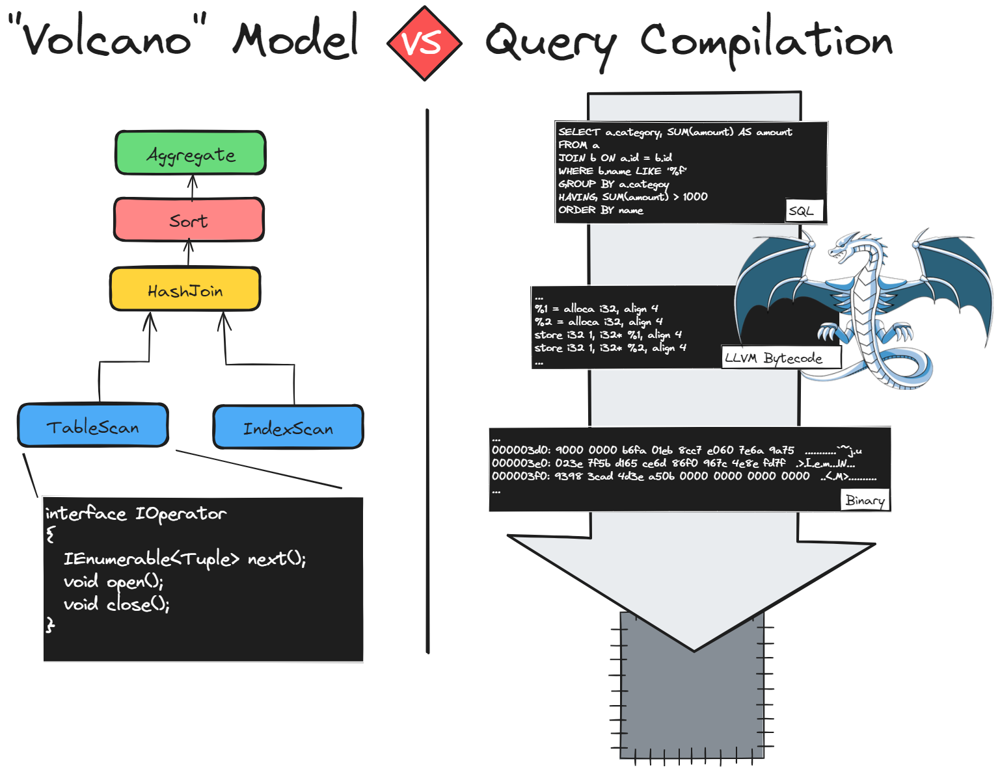
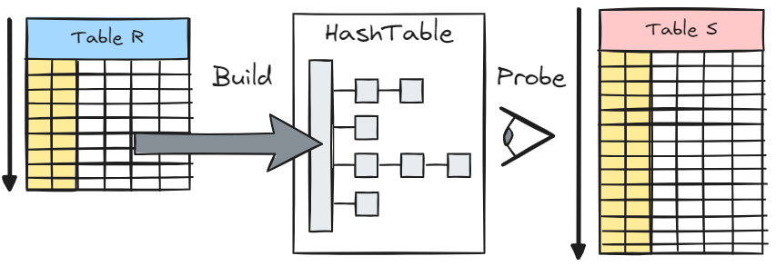
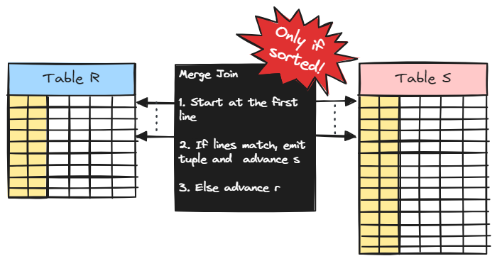
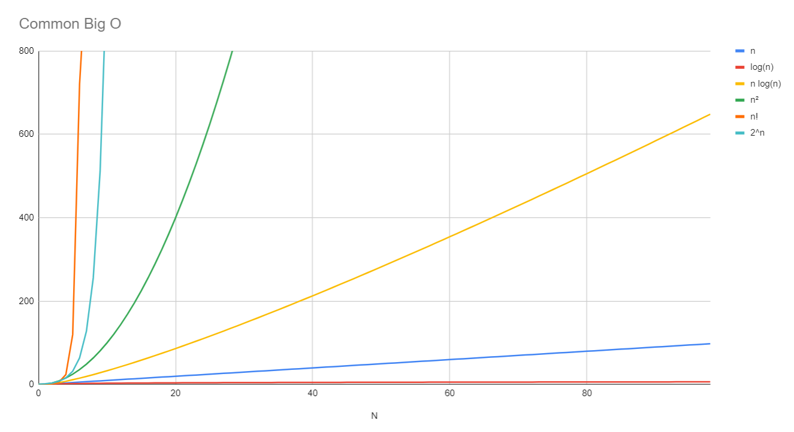
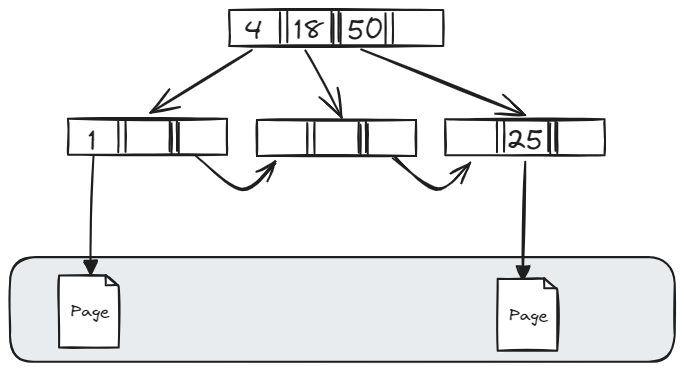

<!-- _class: lead -->
# **Module 2**
Querying data

---
<!-- _class: chapter lead invert-->
## **Relational Algebra**

---
# **Relational Algebra**

#### Basic Operations

|Operator|Description|SQL Translation|
|-|-|-|
|Π|Project|`SELECT` + `FROM`|
|ρ|Rename|`AS`
|σ|Select|`WHERE`|
---
# **Relational Algebra**

#### Set Operations

|Operator|Description|SQL Translation|
|-|-|-|
|∪|Union|`UNION`|
|∩|Intersection|`INTERSECT`|
|-|Set Difference|`EXCEPT`|
|/|Division|**⚠️ Not implemented!**|

---
# **Relational Algebra**

#### Join Operators

|Operator|Description|SQL Translation|
|-|-|-|
|⋈|Natural Join|`INNER JOIN`*|
|⋉|Left Semi Join|`WHERE EXISTS(...)`**|
|▷|Left Anti Join|`WHERE NOT EXISTS(...)`**|
|⟕|Left Outer Join|`LEFT OUTER JOIN`|
|⟗|Full Outer Join|`FULL OUTER JOIN`|
---
<!-- _class: chapter lead invert-->
## **Execution Strategies**
---
# **How are queries executed?**

🙋 There are mainly two ways, can you find one?

---



---
# **Volcano**

👍 **Easy** to reason about, compose and enrich

👍 **Everyone** uses it

👎 Performance issues, mostly from instruction-cache misses

---
# **Volcano with SIMD**

**S**ingle **I**nstruction, **M**ultiple **D**ata

Modern CPUs - since the 1990s - can execute vectorized instructions 
> Instructions operating on **vectors**

This limits the number of instruction **calls**

---
# **Compilation**

Compile SQL to some bytecode, and then to machine code

Only a handful of engines do it (SingleStore is a good example)

---
<!-- _class: chapter lead invert-->
## **Join Implementations**
---
# **Join Algorithms**

🙋 What could be the simplest way to code an `INNER JOIN`?

---
# **Join Algorithms**

🙋 What could be the simplest way to code an `INNER JOIN`?

A **Nested Loop Join**!
```c#
foreach Tuple r in R
    foreach Tuple s in S do
        if SatisfyJoinCondition(r,s)
             yield new Tuple(r,s)
```
---
# **Nested Loop Join**

The complexity is O(m **x** n) with **m** and **n** the respective cardinality of both relations

Runs with **constant** memory

Supports **any matching condition** and early interruption (e.g. `LIMIT`)

---
# **Hash Join**



---
# **Hash Join**

The number of operations reduces to O(m **+** n) if we assume **O(1)** lookups

The memory requirements scale with the **build-side table size** 

Supports **only equi-joins**

---
# **Merge Join**



---
# **Merge Join**

Runs in **O(1)** memory, with  O(m **+** n) operations

Works only on **sorted** tables

Supports **only equi-joins**

---
# **Sort Merge Join**

We can decide to **pay the cost of sorting** to perform a Merge Join

Sorting would be typically O(n log (n) + m log(m)), which makes the total complexity O(m + m log(m) + n + m log(n))

> We thus consider the complexity to be **O(m log(m) + n log(n))**

---
# **As a reminder**



---
# **Recap on Joins**

|Algorithm|Instructions|Memory|Constraints
|-|-|-|-|
|Nested Loop|O(m*n)|0(1)|None
|Hash Join|O(m+n)|0(n)|Equijoins
|Merge Join|O(m+n)|0(1)|Equijoins + Sorted
|Sort-Merge Join|O(n log(n) + m log(n))|0(1)|EquiJoins

---
<!-- _class: chapter lead invert-->
## **Indexes**

---
# **Full Table Scans**

Without indexes, the only way to retrieve a particular value is to **scan the entire table**

> Think of a book with no table of contents

---
# **B-Trees**

Invented in the **1970s**

Generalization of a **Binary Search Tree** when each node can have up to *m* children

> **m** is usually called  the B-Tree _order_

Used by pretty much every relational database

---
# **B-Trees (continued)**

Every node can have **up to m** children

Every leaf node is at the **same distance from the root**

When leaf nodes are chained, we call them **B+Trees** (allows for traversal)

> In databases, **leaf** nodes typically point to heap pages (data pages)

---
# **B-Trees (continued)**


